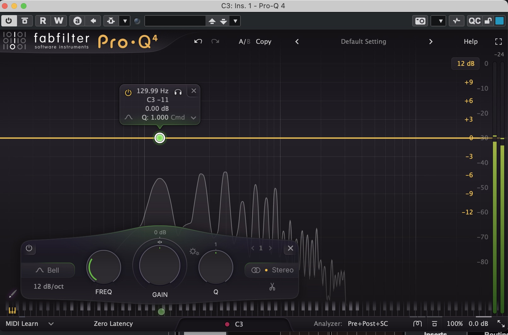

# 도를아십니까 (DO-RULE)


**절대음 C(도)를 구분하는 음성 가창 게임**

[](LICENSE)
[](https://reactjs.org/)
[](https://www.typescriptlang.org/)

---

## 🎮 게임 개요

제시된 단어를 **특정 음정(C3, C4, C5)을 발음**하여 클리어하는 웹 게임입니다.

### 💡 설계 철학

**틱톡/릴스 숏폼 콘텐츠 활용을 염두하여** 개발 하였습니다.

- **프론트엔드 중심 아키텍처**: 빠른 반응성과 부드러운 UI/UX
- **즉각적 피드백**: 실시간 음정 시각화
- **모바일 최적화**: 390x844
- **카메라 모드**: 실시간 녹화 및 공유 기능 (업데이트를 통해 제공)

추후 업데이트를 통해 플레이 화면과 리액션을 함께 녹화할 수 있습니다.

### 핵심 규칙

예: "모나리자" (4글자) = 4번 시도
- 1번: **모(C4)** + 나(C3) + 리(C3) + 자(C3)
- 2번: 모(C3) + **나(C4)** + 리(C3) + 자(C3)
- 3번: 모(C3) + 나(C3) + **리(C4)** + 자(C3)
- 4번: 모(C3) + 나(C3) + 리(C3) + **자(C4)**

각 시도마다 한 글자는 **High C**, 나머지는 **Low C**로 발음해야 합니다.

### 음정 매핑

| 성별 | 난이도 | Focus | Base |
|------|--------|-------|------|
| 남자 | Easy/Normal | C4 (261Hz) | C3 (130Hz) |
| 남자 | Hard | C3 (130Hz) | C4 (261Hz) |
| 여자 | Easy/Normal | C5 (523Hz) | C4 (261Hz) |
| 여자 | Hard | C4 (261Hz) | C5 (523Hz) |

---

## 🛠️ 기술 스택

### Frontend
- **React** + **TypeScript**: UI 구축
- **Zustand**: 전역 상태 관리
- **Tailwind CSS** + **Framer Motion**: 스타일링 & 애니메이션

### 음성 인식
- **Web Audio API**: 마이크 입력 처리
- **pitchfinder (YIN)**: 피치 감지 (정확도 95%+)
- **OscillatorNode**: 가이드 톤 생성

### AI
- **Ollama (eeve)**: 한국어 제시어 동적 생성
- Fallback Generator: Ollama 실패 시 백업

### 빌드
- **Vite**: 빠른 개발 서버 & 빌드

---

## 🎹 주파수 측정

FabFilter Pro-Q 4로 실측한 결과:




- **C3**: 129.99Hz → 이론: 130.81Hz
- **C4**: 264.10Hz → 이론: 261.63Hz  
- **C5**: 530.00Hz → 이론: 523.25Hz

**코드 적용:**
```typescript
// src/core/PitchDetector.ts
private readonly frequencies = {
  C3: 130.81,  // 실측: 129.99Hz (오차 0.82Hz)
  C4: 261.63,  // 실측: 264.10Hz (오차 2.47Hz)
  C5: 523.25   // 실측: 530.00Hz (오차 6.75Hz)
};
```

> 💡 실측값과 이론값의 차이(±7Hz)는 피아노 조율 상태에 따른 것으로, 게임에서는 표준 이론값을 사용하여 범용성을 확보했습니다.

## 제시어 생성 **

1. 라운드 시작 시 eeve에 요청
   "4글자, 유머러스한 일상어 8개 생성해줘"
   
2. eeve가 응답
   "불닭볶음, 양념치킨, 김치찌개, ..."
   
3. 응답 파싱 (한글만 필터링, 중복 제거)

4. 게임에 단어 전달

5. 네트워크 실패 시 → 폴백 단어 사용


** 음성 입력 **

1. 마이크의 **'배경 소음'**과 **'실제 목소리'**를 구분하도록 '볼륨 문턱값'을 설정했습니다. (아무 말 안 할 땐 조용히 있도록!)

// 소리가 너무 작으면 스킵 (매우 관대하게 조정)
if (max < 0.0005 || rms < 0.00001) {
  return null;
}

YIN 알고리즘이 실패하면 즉시 **Autocorrelation**(자기상관) 방식으로 전환됩니다.

**Autocorrelation이란?**
- 파형이 스스로 반복되는 주기를 찾는 방법
- 예: "도도도도" 소리 → 반복 간격 측정 → 주파수 계산
- YIN보다 단순하지만 빠르고 안정적

즉, 음정이 튀거나 마이크 입력이 불안정해도 안정적으로 작동합니다."

그러나 사람의 목소리는 주파수의 복잡성이 너무 다양하기 때문에
현재의 프로토타입에서는 정확도가 아쉽습니다.
그렇기에 조금 관대한 세팅을 해 두었습니다.

---

## 📂 프로젝트 구조

```
src/
├─ components/          # React UI
│  ├─ MainMenu.tsx
│  ├─ GameCanvas.tsx
│  ├─ GameUI.tsx
│  └─ PianoKeyboard.tsx
├─ hooks/
│  └─ useGameLoop.ts    # 핵심 게임 로직
├─ store/
│  └─ gameStore.ts      # Zustand 상태
├─ core/
│  ├─ PitchDetector.ts  # 피치 감지 (YIN)
│  └─ OscillatorTone.ts # 가이드 톤
└─ services/
   └─ OllamaService.ts  # AI 제시어 생성
```

---

## 🚀 실행 방법

### 로컬 실행
```bash
# Ollama 실행
ollama pull eeve
ollama serve

# 프로젝트 실행
npm install
npm run dev
# → http://localhost:3001
```

### 외부 접속 (mobile or PC)
```bash
ngrok http 3001
# → https://xxx.ngrok-free.dev
```

### 빌드
```bash
npm run build
# → dist/ 폴더 생성
```

---

## 🐛 디버깅

### 마이크 안 됨
- 브라우저 주소창 자물쇠 → 마이크 권한 허용

### Ollama 연결 실패
- `ollama serve` 실행 확인
- 실패 시 Fallback 자동 작동

### 피치 감지 안 됨
- F12 → Console에서 "오디오 레벨" 확인
- 마이크 볼륨 높이기
- 정확한 음정으로 발음

---

## 📝 로드맵

### 계획 중
- **🎤 싱어 모드**: C3~C6 전체 음역대 사용, 모든 글자 다른 음정
- 멀티플레이어 (WebSocket)
- 리더보드 (Firebase)
- 튜토리얼 & 데일리 챌린지

### 최적화
- React.memo로 리렌더 최소화
- Web Worker로 피치 감지 분리
- Ollama 결과 캐싱

---

## 📄 라이선스

MIT License

---

## 🎵 게임 시연

👉 **[플레이하기](https://hillary-unsecluding-unphilosophically.ngrok-free.dev/)**

> ⚠️ 마이크 권한 필요

---

**Made with 💜 by KUGNUS**
